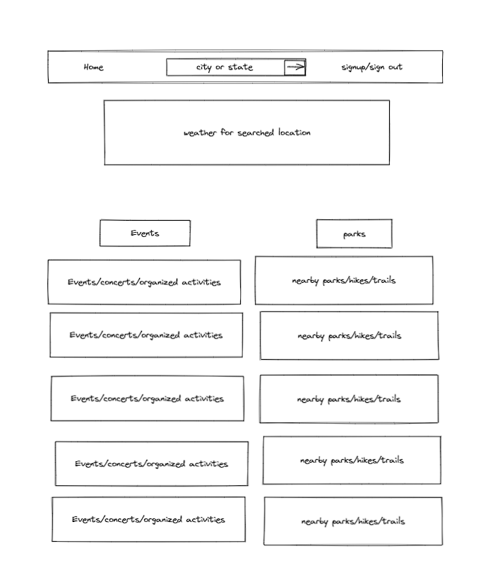

# Graphical Human Interface

## Main Page

This is the main page that people will see when they
get to the Web site.

## Signin Create User Page

This is the page that people will see when they
want to signin or create a user.

## Events Activities Page

This is the page that people will see when they
want view nearby events/activities.

## Preferences Page

This is the page that will allow users to select the activities they are interested. There will be a list of activities to be chked and the preferences will filter the results returned for locations.

## Your Events Page

This is the page that will allow users to see events and activities they have chosen to save to their saved events list. Here they can remove past events as well.

## Signed Out Page

This is the page that people will see when they
sign out.

