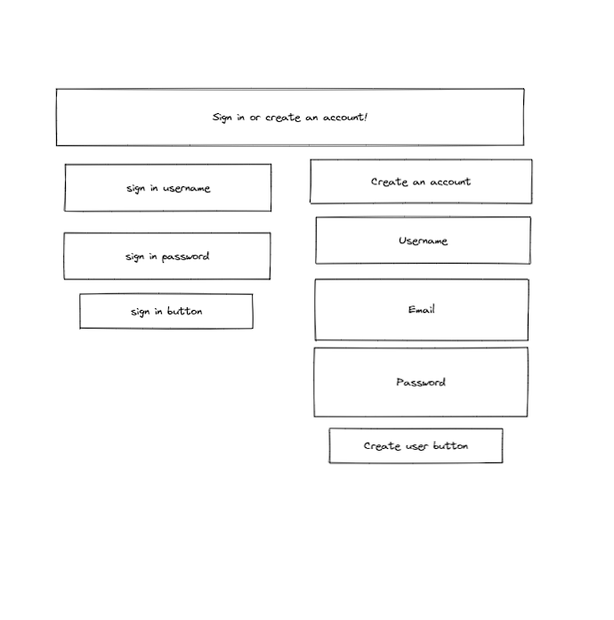

# Graphical Human Interface

## Home Page

This is the main page that people will see when they
get to the Web site.

## Location Entry Page

This is the page that people will see when they
want to enter their zip code to find nearby events/activities.

## Signin Create User Page

This is the page that people will see when they
want to signin or create a user.

## Events Activities Page

This is the page that people will see when they
want view nearby events/activities.

## Signed Out Page

This is the page that people will see when they
sign out.

